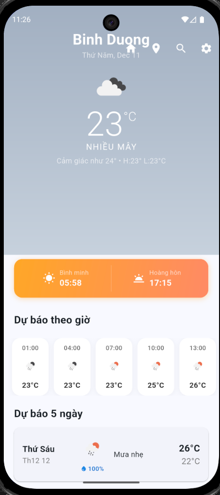
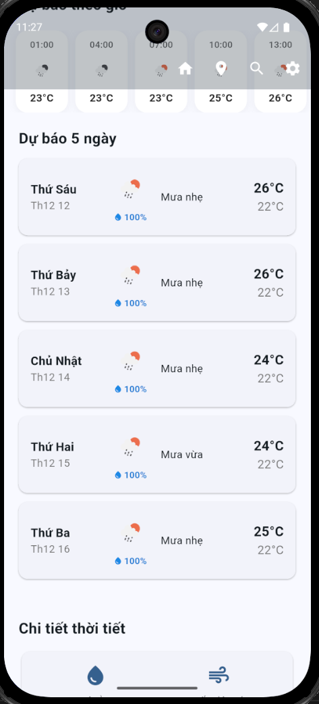
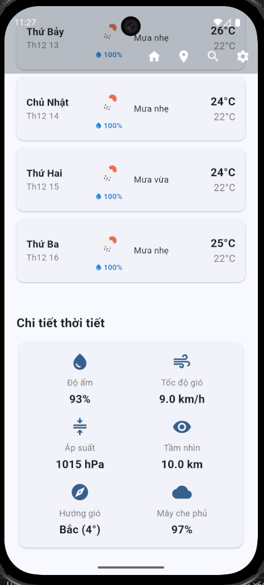
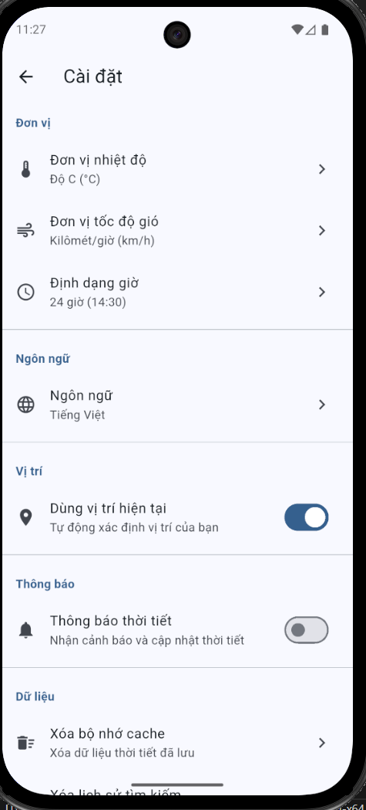
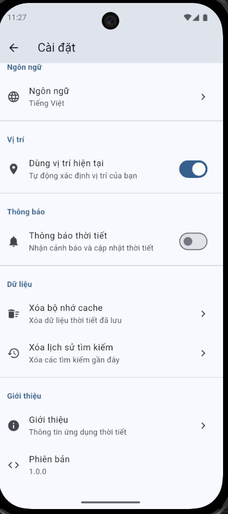
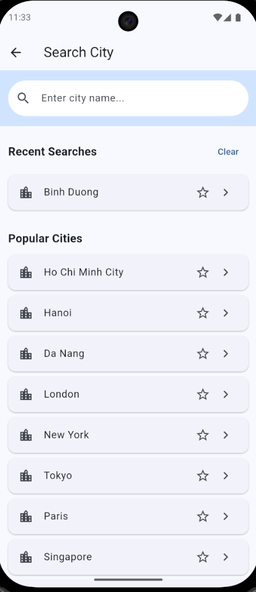

# Ứng dụng Dự báo Thời tiết Flutter
# Demo

https://drive.google.com/file/d/1yEvsUS73FSx7KiBSzti6czHTY-qM4eLo/view?usp=sharing

Một ứng dụng thời tiết đẹp mắt và trực quan được xây dựng bằng Flutter, cung cấp thông tin thời tiết thời gian thực, dự báo và các điều kiện khí quyển chi tiết.

## 📱 Ảnh chụp màn hình

> **Lưu ý**: Tất cả ảnh chụp màn hình được lưu trong thư mục `assets/screenshots/`

### Hiển thị Thời tiết Chính
<table>
  <tr>
    <td></td>
    <td></td>
    <td></td>
  </tr>
  <tr>
    <td align="center">Trang chủ</td>
    <td align="center">Dự báo thời tiết trước 5 ngày</td>
    <td align="center">Chi tiết thời tiết</td>
  </tr>
</table>

### Các Tính năng Bổ sung
<table>
  <tr>
    <td></td>
    <td></td>
    <td></td>
    <td></td>
  </tr>
  <tr>
    <td align="center">Dự báo 5 Ngày</td>
    <td align="center">Cài đặt</td>
    <td align="center">Cài đặt</td>
    <td align="center">Màn hình Tìm kiếm</td>
  </tr>
</table>


## ✨ Tính năng

### Thời tiết Hiện tại
- **Nhiệt độ Thời gian Thực** - Nhiệt độ hiện tại với chỉ số "cảm giác như"
- **Điều kiện Thời tiết** - Biểu diễn trực quan với biểu tượng và mô tả
- **Chỉ số Chi tiết**:
  - Độ ẩm phần trăm (93%)
  - Tốc độ gió (9.0 km/h)
  - Áp suất khí quyển (1015 hPa)
  - Khoảng cách tầm nhìn (10.0 km)
  - Hướng gió (Bắc 4°)
  - Độ che phủ mây phần trăm (97%)

### Dự báo Thời tiết
- **Dự báo Theo giờ** - Dự đoán từng giờ với nhiệt độ và điều kiện
- **Dự báo 5 Ngày** - Triển vọng thời tiết mở rộng với nhiệt độ cao và thấp hàng ngày
- **Xác suất Mưa** - Chỉ báo khả năng mưa (100% hiển thị trong ảnh chụp màn hình)
- **Thời gian Mặt trời Mọc/Lặn** - Lịch trình mặt trời hàng ngày

### Trải nghiệm Người dùng
- **Dịch vụ Vị trí** - Tự động phát hiện vị trí
- **Tìm kiếm Vị trí Thủ công** - Tìm kiếm bất kỳ thành phố nào trên thế giới
- **Nhiều Đơn vị**:
  - Nhiệt độ: Độ C (°C) / Độ F (°F)
  - Tốc độ Gió: km/h hoặc mph
  - Định dạng Thời gian: 24 giờ hoặc 12 giờ
- **Hỗ trợ Ngôn ngữ** - Giao diện Tiếng Việt với khả năng đa ngôn ngữ

### Cài đặt & Tùy chỉnh
- **Tùy chọn Đơn vị** - Nhiệt độ, tốc độ gió và định dạng thời gian
- **Lựa chọn Ngôn ngữ** - Thay đổi ngôn ngữ ứng dụng
- **Cài đặt Vị trí** - Bật/tắt vị trí tự động
- **Quản lý Dữ liệu** - Xóa bộ nhớ cache và lịch sử tìm kiếm


## 🚀 Bắt đầu

### Yêu cầu Trước
- Flutter SDK (3.0.0 hoặc cao hơn)
- Dart SDK (3.0.0 hoặc cao hơn)
- Android Studio / VS Code với các tiện ích mở rộng Flutter
- Một API key từ nhà cung cấp dịch vụ thời tiết

### Hướng dẫn Cài đặt API

1. **Lấy API Key của bạn**:
   - Truy cập [OpenWeatherMap](https://openweathermap.org/api) hoặc [WeatherAPI](https://www.weatherapi.com/)
   - Đăng ký tài khoản miễn phí
   - Tạo API key từ bảng điều khiển của bạn

2. **Cấu hình API Key** (KHÔNG commit file này):
   
   Tạo file `lib/config/api_keys.dart`:
   ```dart
   class ApiKeys {
     static const String weatherApiKey = 'API_KEY_CỦA_BẠN_Ở_ĐÂY';
     static const String weatherApiBaseUrl = 'https://api.openweathermap.org/data/2.5';
   }
   ```

3. **Thêm vào .gitignore**:
   ```
   # API Keys - KHÔNG COMMIT
   lib/config/api_keys.dart
   ```

4. **Tạo File Template** `lib/config/api_keys.template.dart`:
   ```dart
   class ApiKeys {
     static const String weatherApiKey = 'API_KEY_CỦA_BẠN_Ở_ĐÂY';
     static const String weatherApiBaseUrl = 'https://api.openweathermap.org/data/2.5';
   }
   ```

### Các Bước Cài đặt

1. **Clone repository**:
   ```bash
   git clone https://github.com/yourusername/flutter_weather_app.git
   cd flutter_weather_app
   ```

2. **Cài đặt dependencies**:
   ```bash
   flutter pub get
   ```

3. **Thiết lập API keys** (xem Cài đặt API ở trên)

4. **Chạy ứng dụng**:
   ```bash
   # Cho Android
   flutter run

### Thiết lập Theo Nền tảng

#### Android
Thêm quyền vào `android/app/src/main/AndroidManifest.xml`:
```xml
<uses-permission android:name="android.permission.INTERNET"/>
<uses-permission android:name="android.permission.ACCESS_FINE_LOCATION"/>
<uses-permission android:name="android.permission.ACCESS_COARSE_LOCATION"/>
```


## 📂 Cấu trúc Dự án

```
lib/
├── config/
│   └── api_config.dart         
├── l10n
|   ├── app_localizations.dart
|   ├── app_en.arb
|   └── app_vi.arb
├── models/
│   ├── weather_model.dart 
|   ├── hourly_weather_model.dart
|   ├── location_model.dart
│   └── forecast_model.dart
├── services/
│   ├── weather_service.dart
|   ├── storage_service.dart
|   ├── settings_service.dart
|   ├── connectivity_service.dart
│   └── location_service.dart
├── providers/
│   ├── weather_provider.dart 
|   ├── location_provider.dart
|   └── settings_provider.dart
├── screens/
│   ├── home_screen.dart
│   ├── forecast_screen.dart
│   ├── settings_screen.dart
|   └── search_screen.dart
├── widgets/
│   ├── current_weather_card.dart
│   ├── daily_forecast_card.dart
│   ├── weather_detail.dart
|   ├── error_widget.dart
|   ├── hourly_forecast_list.dart
|   ├── loading_shimmer.dart
|   └── sunrise_sunset_card.dart
├── utils/
│   ├── constants.dart  
|   ├── date_formatter.dart
|   ├── weather_icons.dart
│   └── weather_translator.dart
└── main.dart 

assets/
├── screenshots/               
│   ├── clear_weather.png
│   ├── cloudy_weather.png
│   ├── rainy_weather.png
│   ├── night_mode.png
│   ├── forecast_screen.png
│   ├── settings_screen.png
│   ├── search_screen.png
│   ├── loading_state.png
│   └── error_state.png
├── icons/                     
└── images/                 
```


## 🔧 Cấu hình

### Thay đổi Đơn vị Nhiệt độ
Điều hướng đến Cài đặt → Đơn vị → Đơn vị nhiệt độ và chọn:
- Độ C (°C)
- Độ F (°F)

### Bật Dịch vụ Vị trí
Cài đặt → Vị trí → "Sử dụng vị trí hiện tại"
